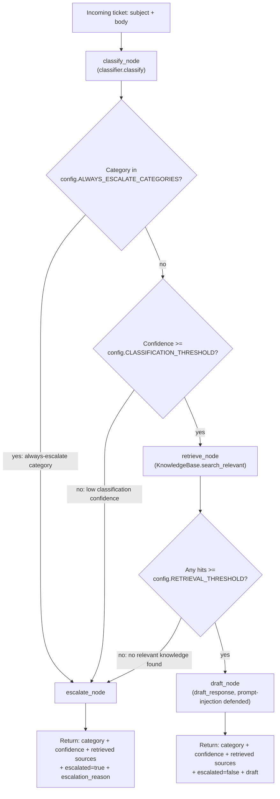

# Stage 1: Pipeline Diagram (~15 min)

## Goal

Produce (or complete) a diagram of the end-to-end Astra Triage workflow
that matches what you'll implement in LangGraph during Stage 3. Do this
*before* writing orchestration code — it's meant to force you to think
through the branching logic first.

Your diagram must show, at minimum:

- Ticket input
- Ticket classification (+ confidence check)
- Knowledge retrieval
- Relevance validation (threshold check)
- Response drafting
- Conditional routing
- Escalation (and the distinct reasons a ticket can land there)
- Final output

## Diagram (matches the implemented astra/graph.py)

`escalate_node` is a single node reached by three distinct, individually
labeled edges (matching the TODO to unify all escalation paths into one
clearly labeled output) — but the specific `escalation_reason` string it
produces differs by which edge actually fired. See `astra/graph.py`'s
`_escalate_node`, which re-derives the reason by checking those same
three conditions in the same priority order (always-escalate category,
then confidence, then empty retrieval) shown top-to-bottom above.

Decision-order note: the always-escalate-category check runs *before*
the confidence check (not alongside it) — an `abuse_or_security` ticket
escalates regardless of how confident the classifier is, which is the
point of that category existing at all.

## Acceptance criteria for this stage

- [x] Diagram covers all 8 required workflow elements listed above.
- [x] All three escalation reasons are shown as distinct paths with labels:
      low classification confidence, no relevant knowledge found, and
      always-escalate category (e.g. `abuse_or_security`).
- [x] The diagram's decision points match the conditional edges
      actually implemented in `astra/graph.py` (verified against the
      real `_decide_after_classify` / `_decide_after_retrieve` /
      `_escalate_node` logic after Stage 3 was built, not just sketched
      up front).
- [x] Committed to git with a message like
      `docs: complete stage1 pipeline diagram`.
