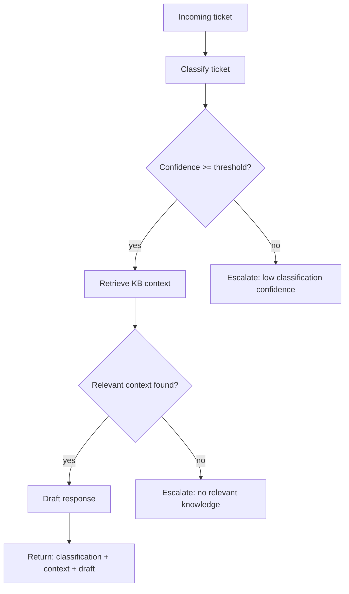

# Stage 1: Pipeline Diagram (~15 min)

## Goal

Produce (or complete) a diagram of the end-to-end Astra Triage workflow
that matches what you'll implement in LangGraph during Stage 3. Do this
*before* writing orchestration code — it's meant to force you to think
through the branching logic first.

Your diagram must show, at minimum:

- Ticket input
- Ticket classification (+ confidence check)
- Knowledge retrieval
- Relevance validation (threshold check)
- Response drafting
- Conditional routing
- Escalation (and the distinct reasons a ticket can land there)
- Final output

## Starter skeleton (intentionally incomplete — finish it)

The boxes and the happy path are sketched below. You need to add the
missing escalation branches and label every decision edge with the
condition that triggers it.

## Acceptance criteria for this stage

- [ ] Diagram covers all 8 required workflow elements listed above.
- [ ] All three escalation reasons are shown as distinct paths with labels:
      low classification confidence, no relevant knowledge found, and
      always-escalate category (e.g. `abuse_or_security`).
- [ ] The diagram's decision points match the conditional edges you
      actually implement in `astra/graph.py` during Stage 3 — if they
      drift apart while you build, come back and fix this file.
- [ ] Committed to git with a message like
      `docs: complete stage1 pipeline diagram`.
